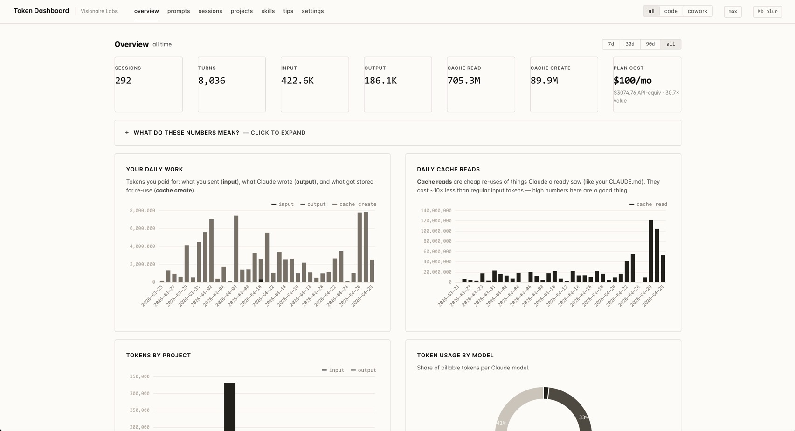

# Claude Token Dashboard

A local dashboard for what Claude actually costs — Code and Cowork together. Reads the JSONLs Claude Code writes to `~/.claude/projects/` and the audit logs Cowork writes to `~/Library/Application Support/Claude/local-agent-mode-sessions/`, and turns both into per-prompt cost analytics, tool/file heatmaps, project comparisons, and cache analytics.

If you're on Claude Max ($100/mo) and use Cowork, the official tools won't tell you what your usage would have cost on pay-per-token rates, or whether the subscription pays for itself. This does — separately for each surface, or both stacked.

Everything runs locally. No telemetry, no login, no data leaves your machine.



Forked from [`nateherkai/token-dashboard`](https://github.com/nateherkai/token-dashboard) (MIT) and extended with Cowork visibility, a source toggle, a plan-cost flip, and a redesign per [Impeccable](https://github.com/VisionaireLabs/impeccable).

## What's different from upstream

| | Upstream | This fork |
|---|---|---|
| Sources | Claude Code only | Claude Code + Cowork |
| DB | `messages`, `tool_calls` | Same, plus a `source` column |
| Topbar | Brand + tabs | Brand + tabs + 3-way source toggle (`all` / `code` / `cowork`) |
| Cost card on subscription | API-equivalent figure (~$3,010), monthly fee in subline | Monthly fee leads (`$100/mo`), API-equivalent + value multiple in subline |
| Theme | Dark observability template | Light, OKLCH tinted-neutral palette |
| Color strategy | Multi-hue accent palette | Restrained — no chromatic accent, grayscale chart ramp |
| KPI display | Card grid | Hairline strip (`hero-metric-template` is an Impeccable absolute ban) |

## What this answers

- *Am I getting my $100/mo of value out of Max?* The cost card shows the multiple in plain English.
- *Where are my tokens going?* Per-prompt breakdown, file/tool heatmaps, project comparison.
- *Why was that one session so expensive?* Click any prompt → see the assistant response and tool-result sizes.
- *Are my Cowork sessions burning cache reads?* They probably are. The dashboard separates cache reads from billable input so you can tell.

## Prerequisites

- Python 3.8+ (already on macOS).
- Claude Code, Cowork, or both — used at least once.
- A modern browser.

No `pip install`. No Node. No build step.

## Quickstart

```bash
git clone https://github.com/VisionaireLabs/claude-token-dashboard.git
cd claude-token-dashboard
python3 cli.py dashboard
```

Scans both `~/.claude/projects/` and `~/Library/Application Support/Claude/local-agent-mode-sessions/`, starts a server at http://127.0.0.1:8080, and opens your browser. `Ctrl+C` to stop.

The Cowork tree is large (typically 1–3 GB of audit logs and snapshots). First scan walks 500+ JSONLs and may take 60–120 seconds on a heavy user's machine. Subsequent scans are incremental.

## CLI

```bash
python3 cli.py scan                  # rescan both sources
python3 cli.py scan --code-only      # only ~/.claude/projects/
python3 cli.py scan --cowork-only    # only Cowork
python3 cli.py today                 # today's totals
python3 cli.py stats                 # all-time totals
python3 cli.py tips                  # active suggestions
python3 cli.py dashboard             # scan + serve at :8080
```

### Environment variables

| Var | Default | Purpose |
|---|---|---|
| `CLAUDE_PROJECTS_DIR` | `~/.claude/projects` | Claude Code JSONL root |
| `CLAUDE_COWORK_DIR` | `~/Library/Application Support/Claude/local-agent-mode-sessions` | Cowork session root |
| `TOKEN_DASHBOARD_DB` | `~/.claude/token-dashboard.db` | SQLite cache |
| `PORT` | `8080` | Server port |
| `HOST` | `127.0.0.1` | Bind address. Don't set `0.0.0.0` on networks you don't fully control. |

## Source toggle

The topbar has a three-way filter (`all` / `code` / `cowork`). Selection persists across reloads via localStorage and is applied to every API call as `?source=...`. Cowork projects are prefixed `cowork:<workspace-id>` so they sort separately in the Projects tab.

## Design system

Built using Visionaire Labs' [Impeccable](https://github.com/VisionaireLabs/impeccable) skill — a fork of Anthropic's frontend-design skill. Visual identity is documented in [`PRODUCT.md`](PRODUCT.md) and [`DESIGN.md`](DESIGN.md). Edit those before changing the visual layer; both files are loaded by `/impeccable` commands.

## Privacy

Nothing leaves your machine. The dashboard fetches its JSON from `127.0.0.1`; CSS and ECharts are vendored. `Cmd/Ctrl+B` blurs prompt text and other sensitive content for screenshots.

## Tech stack

Python 3 (stdlib only) for the CLI, scanners, and HTTP server. SQLite for the local cache. Vanilla JS + ECharts for the UI, no build step.

Data flow: `cli.py` → `scanner.py` (Claude Code) and `cowork.py` (Cowork) → SQLite → `server.py` exposes `/api/*` JSON routes and serves `web/`.

## Limitations

- Skill token-per-call is partial when skills live outside `~/.claude/skills/` (inherited from upstream).
- Cowork audit JSONLs include `_audit_timestamp` instead of `timestamp` on assistant rows; the scanner backfills, but if Anthropic changes the audit schema this is the first thing to break.
- Pricing math underneath is still pay-per-token rates; the subscription flip just promotes the flat fee to primary.

## Contributing

`python3 -m unittest discover tests` before opening a PR. Stdlib-only.

## License

MIT, inherited from upstream. See [`LICENSE`](LICENSE) and [`NOTICE.md`](NOTICE.md) for attribution.
